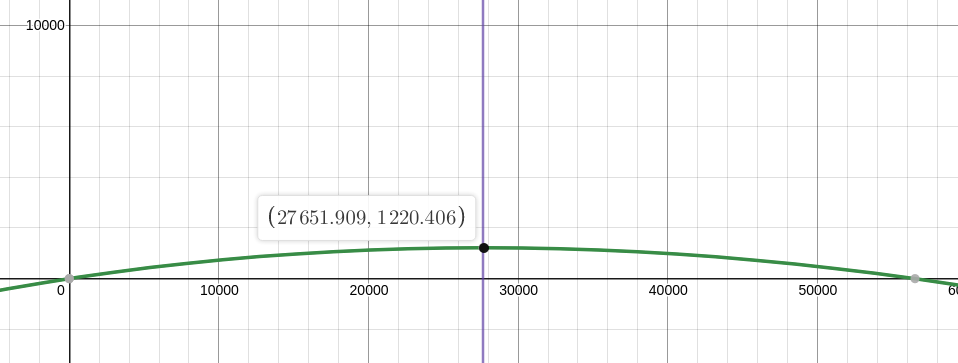

# About

Unlike Uniswap clones some DEXs use very different formulas for trading. This means that finding optimal amount for arbitrage between them requires extra complexity and the purpose of this project is to address it and implement it. 

# Strategy

One of the solutions for finding the optimal amount for dexes with different trading formulas is to chain amountOut from the functions to express the output amount as a single formulas with single variable as an input amount and finally get the input amount where derivative of this formula equals zero. This is better described below:

#### Dex formulas:

 - f(x) => Dex1 Formula
 - g(x) => Dex2 Formula
 - h(x) => Dex3 Formula

#### Scenario

Dex1 => Dex2 => Dex3 (Assume that input and output assets are the same)

#### Calculation

1. Express all the trades in a single formula which output the *amountOut* and single variable *inputAmount*

```math
F(x) = h(g(f(x)))
```

2. Find the *inputAmount* for which the derivative of F is zero

```math
F'(x) = 0
```
This *inputAmount* should be the optimal amount. 

**Note that instead of step 2 [golden section search could be used](https://en.wikipedia.org/wiki/Golden-section_search).**


# Installation

#### Modules
```javascript
npm i
```

#### Secrets
All secrets used in the module are stored in the `.env` file, see the `.env.sample` for more details. 

One of the secrets used is the provider url and uri, which allow user to connect to public nodes. Please refer to Infura, Alchemy, or any other provider to obtain these.

## DODO

## Theory

Dodo trading formulas change depending on the state of the market - market is either is base shortage, quote shortage or in equilibrium. 


This introduces different formulas for each scenario which can are explained in Notion page about [Dodo AMM](https://www.notion.so/Dodo-4e903e2d95bd47beb7c1baff331ee2cb).


# Testing

## Test trade functions
The aim here is to check if the implemented math reflects what happens in smart contract. To achieve that smart contract calls are made and then compared to the calculations for the same conditions. 

All cases are for ETH-USDC Dodo pool with contract addresses [0x75c23271661d9d143DCb617222BC4BEc783eff34](https://etherscan.io/address/0x75c23271661d9d143DCb617222BC4BEc783eff34).

Block for base shortage was chosen as 11907386 and 11907345 for quote shortage.

### Results


```javascript
quote-shortage | buy-base | above-equilibrium

Pool state:  QUOTE-SHORTAGE
Pool info:
 {
  Q0: 12517173.506316,
  B0: 8161.89015095085,
  tradeAllowed: true,
  lpFee: 0.005,
  Q: 12198777.781694,
  i: 1699.792419,
  B: 8353.115942428565,
  R: 2,
  k: 0.8
}
Base amount:  286.83868721657336
Past equilibrium:  true
Quote amount from call: 484943.805016
Quote amount from calculation: 483154.45523484825
Base amount from calculation: 286.83868721657655
```


### Run it yourself

To test the formulas run:

```javascript
npm run test-formulas {-- [flags]}
```
You can optionally add the following flags:
 - `--base-short`/`--quote-short`: Only cases in base/quote shortage shown
- `--buy-base`/`--sell-base`: Only cases where base is bought/sold
- `--above-eq`/`--below-eq`: Only cases which overshoot/undershoot the equilibrium with the trade

Example:
```javascript
npm run test-formulas -- --base-short --above-eq
```


## Test optimal amount 

Formulas for optimal amount were made according to the strategy(see section **Strategy**) and were checked by two methods. Optimal amount was also calculated using [golden section search module](https://github.com/DTrejo/gss) and profits between supposedly "optimal" amounts and their multiple of 99% and 101% were compared. Note that none of these functions accounts for fees


### Case#1
>Swap USDC for ETH on Uniswap and then swap ETH for USDC on Dodo

**Test case for optimal amount in following setting:**
 * Uniswap --> Dodo
 * base shortage
 * sell base


##### Formula for the optimal amount

*Access the graph [here](https://www.desmos.com/calculator/pmswbygoy4)*

##### Terminal output
```javascript
CASE#1
^^^^^^^^^^^^^^^^^^^^^^^^^^^^^^^^^^^^^^^^^^^^^^^^^^^^^^^^^^^^
Input amount: 27570.588045411638 | Is optimal: false
Uniswap amount out: 17.52249075738559 | Price: 1573.4400107353947
Dodo amount out: 28805.509129224345 | Price: 1643.9163545903457
Profit:  1234.9210838127074
^^^^^^^^^^^^^^^^^^^^^^^^^^^^^^^^^^^^^^^^^^^^^^^^^^^^^^^^^^^^
Input amount: 27849.07883374913 | Is optimal: true
Uniswap amount out: 17.691657282681945 | Price: 1574.1362377062383
Dodo amount out: 29084.11831600219 | Price: 1643.9453834815197
Profit:  1235.0394822530616
^^^^^^^^^^^^^^^^^^^^^^^^^^^^^^^^^^^^^^^^^^^^^^^^^^^^^^^^^^^^
Input amount: 28127.56962208662 | Is optimal: false
Uniswap amount out: 17.860674232324868 | Price: 1574.8324646770818
Dodo amount out: 29362.49098088965 | Price: 1643.974387470121
Profit:  1234.9213588030289
```
##### Conclusion

The desmos optimal amount is still within 1% of the optimal amount obtained with gss.


### Case#2
>Swap ETH for USDC on Dodo and then swap USDC for ETH on Uniswap

**Test case for optimal amount in following setting:**
 * Dodo --> Uniswap
 * base shortage
 * sell base


##### Formula for the optimal amount

*Access the graph [here](https://www.desmos.com/calculator/7hkubrlsiz)*

##### Terminal output


```javascript
CASE#2
^^^^^^^^^^^^^^^^^^^^^^^^^^^^^^^^^^^^^^^^^^^^^^^^^^^^^^^^^^^^
Input amount: 16.74151323763721 | Is optimal: false
Dodo amount out: 27519.403958303854 | Price: 1573.312050517625
Uniswap amount out: 17.491383193340365 | Price: 0.9571291791269739
Profit:  0.7498699557031543
^^^^^^^^^^^^^^^^^^^^^^^^^^^^^^^^^^^^^^^^^^^^^^^^^^^^^^^^^^^^
Input amount: 16.91061943195678 | Is optimal: true
Dodo amount out: 27797.86839737743 | Price: 1574.0082116153092
Uniswap amount out: 17.660561229760145 | Price: 0.9575357890359891
Profit:  0.7499417978033662
^^^^^^^^^^^^^^^^^^^^^^^^^^^^^^^^^^^^^^^^^^^^^^^^^^^^^^^^^^^^
Input amount: 17.079725626276346 | Is optimal: false
Dodo amount out: 28076.342662751675 | Price: 1574.7043972787446
Uniswap amount out: 17.829595644281273 | Price: 0.9579423990893791
Profit:  0.7498700180049269
```
##### Conclusion

The desmos optimal amount is still within 1% of the optimal amount obtained with gss.


### Run it yourself

To test the formulas run:

```javascript
npm run test-optimal {-- [flags]}
```
You can optionally add the flags to only run a subset of test cases - flag is a function name.  

Example:
```javascript
npm run test-optimal -- --case1
```


## Test strategy
...


 # Ideas

 #### Use memoization to get optimal amount with formulas
 Computing the derivative of a random function is CPU heavy and in this case for every path will have its own function which could slow down the performance considerbly. To avoid that compiled derivatives could for each path could be stored in path for later reuse. See more on memoization [here](https://blog.bitsrc.io/understanding-memoization-in-javascript-to-improve-performance-2763ab107092).

